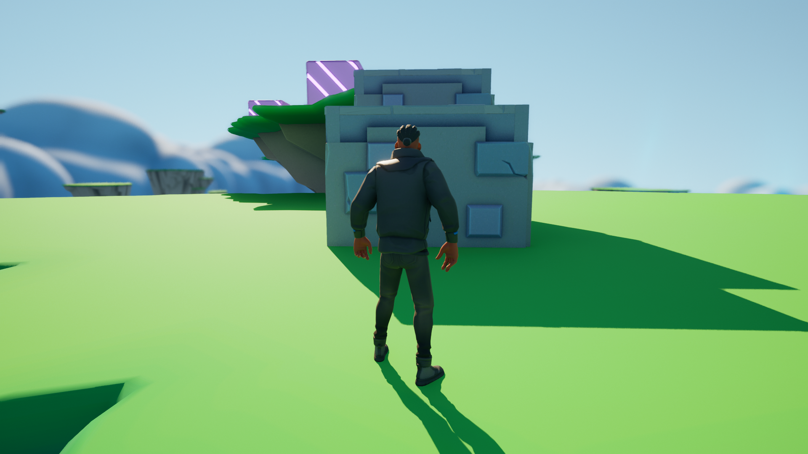
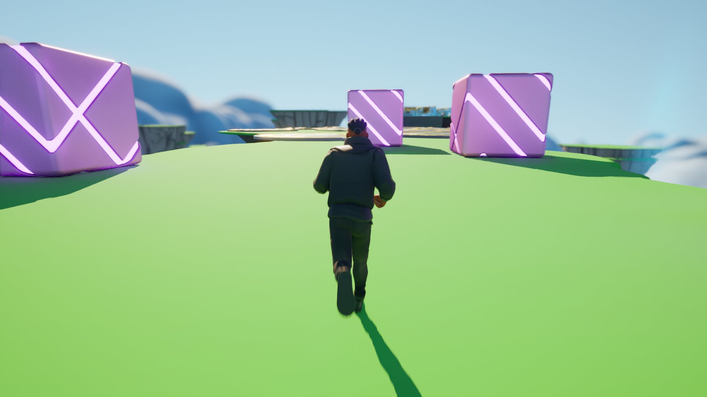
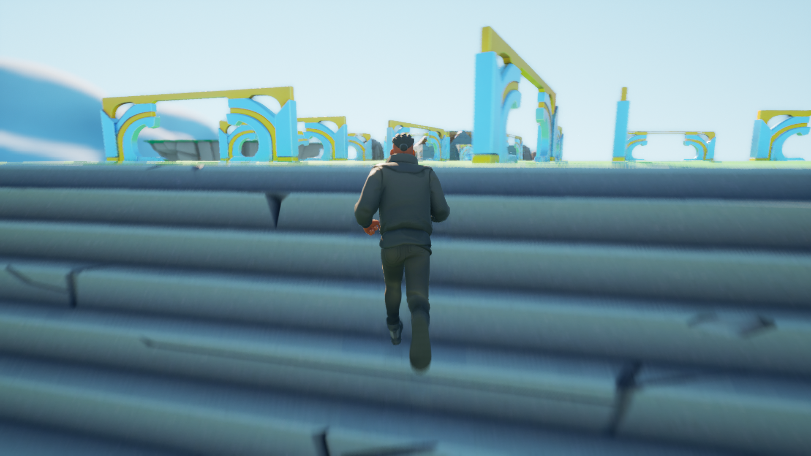
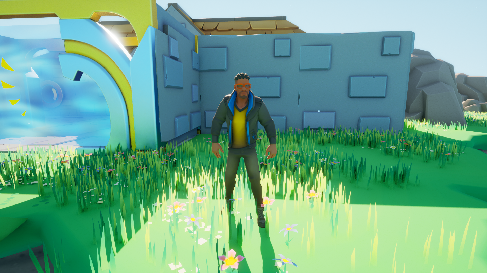

<!-- GAME PROJECT TITLE -->
# ObstacleAssault---Game
Game created for study purposes by Matheus Soares Martins, and is was created to test third-person features, and programming using C++. 
In this game you have a onstacle course that you have to go through, until you reach the castle to steal the famous righteousness element.
 

This game was made to be played by one player, and it uses the commonly used input for games.
 

Player controls 
W - Goes to the front 
A - Goes to the left 
S - Goes into the back direction 
D - Goes to the right 
Spacebar - Makes the character jump 

Other controls 
Left arrow - Rotate camera view to the left. 
Right arrow - Rotate camera view to the right. 
F11 - Toggle between fullscreen and windowed mode. 
******************************************************************************

 

# Screenshots
<!-- GAME PROJECT IMAGES -->

# <!-- GAME PROJECT BUILDS -->
# Game download 
## Windows: https://mega.nz/folder/oY1READa#_iPmaVkLyFhUShUBomwA5A